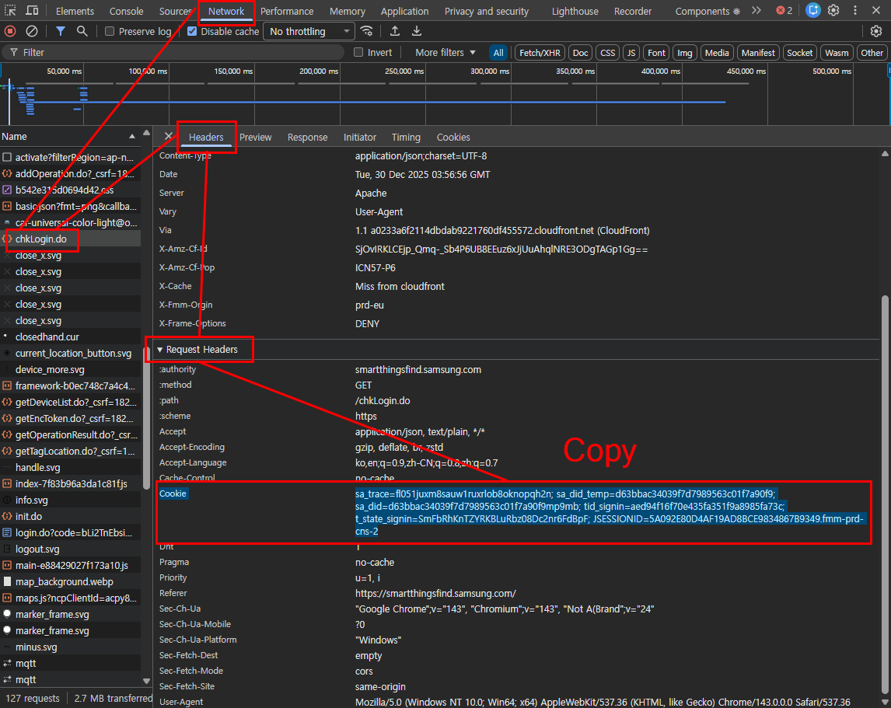

# SmartThings Find

Samsung **SmartThings Find** 비공식(역공학) 연동을 Home Assistant에서 쓰기 위한 커스텀 통합입니다.  
원본 프로젝트(`Vedeneb/HA-SmartThings-Find`)를 기반으로, **현재 삼성 로그인 흐름 변경으로 QR 로그인이 사라진 상태**에 맞춰 **브라우저 쿠키(Cookie header) 수동 입력 방식**으로 포크/수정한 버전입니다.

> ⚠️ 주의: 공식 API가 아닙니다. 삼성 웹/백엔드 변경으로 언제든 동작이 깨질 수 있습니다.

---

## Features

기기마다 아래 엔티티가 생성됩니다.

- **Device Tracker**: 기기 위치(GPS)
- **Sensor**: 배터리(가능한 기기만)
- **Button**: Ring(벨 울리기) 요청

---

## Install (HACS)

아래 버튼을 누르면, Home Assistant에서 HACS 커스텀 레포 추가 화면으로 이동합니다.

[](https://my.home-assistant.io/redirect/hacs_repository/?owner=1bobby-git&repository=HA-SmartThings-Find&category=integration)

1. HACS → **Integrations** → 우측 상단 ⋮ → **Custom repositories**
2. Repository: `https://github.com/1bobby-git/HA-SmartThings-Find`
3. Category: **Integration**
4. 설치 후 Home Assistant 재시작

---

## Setup (Authentication)

통합 추가 화면으로 바로 이동하는 버튼입니다.

[](https://my.home-assistant.io/redirect/config_flow_start/?domain=smartthings_find)

현재는 QR 로그인 엔드포인트가 동작하지 않는 경우가 많아, **브라우저에서 로그인한 세션 쿠키를 그대로 붙여넣는 방식**으로 인증합니다.

### 쿠키 추출 방법 (권장: `chkLogin.do`)
1. 브라우저에서 `https://smartthingsfind.samsung.com/` 로그인
2. 개발자도구(F12) → **Network**
3. 페이지 새로고침(Refresh)
4. 요청 목록에서 **`chkLogin.do`** 클릭
5. **Request Headers → `Cookie:`** 라인을 **통째로 복사**
6. Home Assistant → 설정 → 디바이스 및 서비스 → 통합 추가 → **SmartThings Find**  
   → 입력창에 **Cookie 줄 전체** 붙여넣기



> ✅ 팁: `JSESSIONID`만 넣으면 실패할 수 있습니다.  
> 가능하면 `chkLogin.do` 요청의 **Cookie 헤더 전체**를 넣어주세요.

---

## Active / Passive mode

이 통합에는 위치 갱신 방식이 두 가지가 있습니다.

- **Passive mode**: 서버에 “마지막으로 보고된 위치”를 읽기만 함 (배터리 영향 적음)
- **Active mode**: 위치 업데이트 요청을 보내 최신 위치를 유도 (정확도/즉시성 ↑, 배터리 영향 ↑)

### 모드는 어떻게 설정하나요?
옵션에서 기기 유형별로 **Active / Passive를 선택**합니다.

- 옵션이 **켜져 있으면(ON) = Active mode**
- 옵션이 **꺼져 있으면(OFF) = Passive mode**

기기 타입별로 나누는 이유:
- **SmartTag**는 Active로 얻는 이점이 큰 편이고,
- **기타 기기(폰/워치/이어버드 등)** 는 Active 요청이 배터리/상태에 영향을 줄 수 있어 분리해 둡니다.

---

## Options

Home Assistant → 통합 → SmartThings Find → **구성(Configure)**

- `update_interval` : 업데이트 간격(초)
- `active_mode_smarttags` : SmartTag Active mode
- `active_mode_others` : 기타 기기(폰/워치/이어버드 등) Active mode

---

## Notes / Limitations

- “Ring”은 주변의 갤럭시 기기(폰/태블릿)가 BLE로 태그에 전달하는 구조라, 주변에 연결 기기가 없으면 실패할 수 있습니다.
- 기기 종류에 따라 위치/배터리 정보가 항상 오지 않을 수 있습니다.
- 비공식 통합이라 삼성 측 변경에 취약합니다.

---

## Debug (Logs)

`configuration.yaml`에 추가 후 재시작:

```yaml
logger:
  default: info
  logs:
    custom_components.smartthings_find: debug
```
