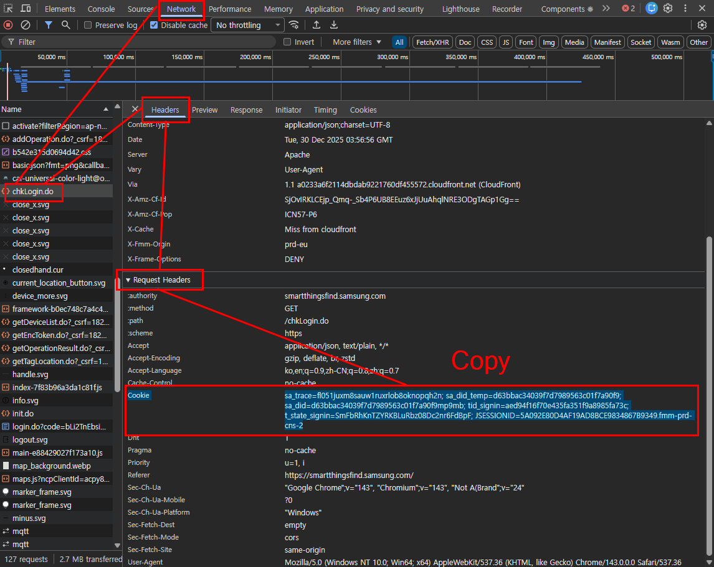

<!-- project-branding:start -->
<p align="center">
  
</p>
<p align="center">
  <a href="https://github.com/1bobby-git/HA-SmartThings-Find/stargazers"></a>
  <a href="https://github.com/1bobby-git/HA-SmartThings-Find/releases"></a>
  <a href="https://github.com/1bobby-git/HA-SmartThings-Find/blob/main/custom_components/smartthings_find/manifest.json"></a>
  <a href="https://github.com/1bobby-git/HA-SmartThings-Find/blob/main/LICENSE"></a>
  <a href="https://github.com/1bobby-git/HA-SmartThings-Find/commits/main"></a>
</p>
<!-- project-branding:end -->

# SmartThings Find

> **Compatibility**: Home Assistant **2024.12+** 권장

Samsung **SmartThings Find**의 비공식 웹 기능을 Home Assistant에서 사용하는 커스텀 통합입니다. 기기 위치, 배터리, 마지막 업데이트, 벨 울리기 및 위치 갱신 요청을 Home Assistant 엔티티로 제공합니다.

> ⚠️ 공식 API가 아닌 역공학 기반 통합입니다. 삼성 웹·인증 규격이 변경되면 동작이 달라질 수 있습니다.

## v1.4.2 인증 방식 단일화

신규 설치, 재인증, 재구성에서 제공하는 인증 방식은 **SmartThings Find Cookie header 하나뿐입니다.**

이전에 제공했던 Samsung Account 인증은 삼성 네이티브 앱용 고정 `ms-app://` 콜백이 필요합니다. 일반 PC 브라우저와 아이폰 Safari에서는 전체 콜백을 안정적으로 받을 수 없으며, 다음 완료 주소만으로는 인증에 필요한 값을 얻을 수 없습니다.

```text
https://account.samsung.com/accounts/ANDROIDSDK/signInComplete
```

따라서 일반 사용자가 완료할 수 없는 Samsung Account 등록 화면과 콜백 처리 코드를 제거했습니다.

- 신규 설치: SmartThings Find Cookie 입력 화면으로 바로 이동
- 재인증: 새 SmartThings Find Cookie 입력
- 재구성: 새 SmartThings Find Cookie 입력 후 설정 저장
- 기존 Samsung Account 등록 성공 항목: 저장된 인증이 유효한 동안만 런타임 호환 유지
- 기존 항목이 재인증 또는 재구성되면 Cookie 방식으로 전환하고 이전 장기 인증 파일 삭제

### 삼성 계정 페이지 쿠키는 사용할 수 없음

`account.samsung.com`에서 생성된 다음과 같은 쿠키는 SmartThings Find 인증 쿠키가 아닙니다.

```text
G_ENABLED_IDPS
sa_did
sa_did_temp
sa_trace
sa_analytics_sid
USAWSWIPSESSIONID
stk
account.samsung.com의 JSESSIONID
```

같은 `JSESSIONID` 이름이라도 생성한 도메인이 다르면 서로 다른 세션입니다. 이 통합에는 반드시 **`smartthingsfind.samsung.com`의 `chkLogin.do` 요청에서 복사한 Cookie 헤더**를 입력해야 합니다.

삼성 계정 페이지 쿠키가 섞인 입력이 SmartThings Find에서 거부되면, 일반 인증 오류 대신 잘못된 쿠키 출처를 안내합니다. 쿠키 원문은 로그에 기록하지 않습니다.

---

## Features

기기마다 아래 엔티티가 생성됩니다. 기기 종류와 삼성 서버 응답에 따라 일부 정보는 제공되지 않을 수 있습니다.

- **Device Tracker**: 기기 위치(GPS)
- **Sensor**
  - 배터리
  - Last update(삼성 서버의 `gps_date` 기준)
- **Button**
  - Ring
  - Stop Ring
  - Update Location

> 이 통합은 SmartTag의 물리 버튼 클릭 이벤트를 받을 수 없습니다. SmartThings Find 웹사이트가 제공하는 기능 범위에서 동작합니다.

---

## Install (HACS)

[](https://my.home-assistant.io/redirect/hacs_repository/?owner=1bobby-git&repository=HA-SmartThings-Find&category=integration)

1. HACS → **Integrations** → 우측 상단 ⋮ → **Custom repositories**
2. Repository: `https://github.com/1bobby-git/HA-SmartThings-Find`
3. Category: **Integration**
4. 설치 후 Home Assistant 재시작

---

## Setup (Authentication)

[](https://my.home-assistant.io/redirect/config_flow_start/?domain=smartthings_find)

### SmartThings Find Cookie header 추출

1. PC 브라우저에서 `https://smartthingsfind.samsung.com/` 로그인
2. 개발자도구(F12) → **Network**
3. 페이지 새로고침
4. 요청 목록에서 **`chkLogin.do`** 선택
5. **Request Headers → `Cookie:`** 전체 줄 복사
6. Home Assistant의 SmartThings Find 설정 화면에 붙여넣기



다음처럼 `Cookie:` 접두어를 포함해도 되고, 세미콜론으로 연결된 쿠키 값만 입력해도 됩니다.

```text
Cookie: JSESSIONID=...; WMONID=...; ...
```

`JSESSIONID` 하나만 임의로 복사하지 말고 `chkLogin.do` 요청의 전체 Cookie 헤더를 사용하세요.

### 아이폰 사용자

삼성 계정 로그인 자체는 아이폰에서도 가능하지만, **아이폰 Safari만으로 요청 Cookie 헤더 전체를 일반적으로 추출할 수는 없습니다.** 최초 설정은 PC의 Chrome, Edge 또는 Firefox에서 진행해야 합니다. 별도의 Android 앱, Windows Galaxy Account 앱 또는 `ms-app://` 콜백 추출은 요구하지 않습니다.

### 세션 보호

Cookie 방식에도 다음 보호 조치가 적용됩니다.

- 응답에서 삼성 서버가 회전시킨 쿠키를 Home Assistant 비공개 저장소에 즉시 반영
- `Logout`, `fail`, HTTP 401/403 발생 시 CSRF 폐기 후 현재 세션 재검증
- KeepAlive, 일반 폴링, 버튼 요청의 쿠키·CSRF 변경 직렬화
- 기본 KeepAlive 180초 및 호출 시점 ±12% 분산
- 서버가 삭제한 쿠키를 이전 저장값에서 되살리지 않고 현재 쿠키 jar를 권위 있는 값으로 저장
- 순수 읽기 요청만 인증 복구 후 제한적으로 재시도
- Ring, 위치 갱신 등 효과 명령은 중복 실행 방지를 위해 자동 재전송하지 않음
- 쿠키와 인증정보 원문을 로그에 기록하지 않음

삼성 서버가 웹 세션 자체를 완전히 취소하면 브라우저에서 새 Cookie header를 복사해 재인증해야 합니다. 브라우저 쿠키만으로 서버가 폐기한 세션을 새로 발급할 수는 없습니다.

> Cookie header와 Home Assistant `.storage` 파일을 이슈, 로그, 채팅에 공유하지 마세요.

---

## 기존 Samsung Account 항목 호환

v1.4.0 또는 v1.4.1에서 전체 콜백 등록에 성공한 기존 항목은 자동으로 삭제하거나 변경하지 않습니다.

저장된 master authorization이 유효한 동안에는 기존 로직으로 만료된 SmartThings Find `JSESSIONID`를 다시 발급할 수 있습니다. 다만 이 기능은 **기존 항목의 런타임 호환 전용**이며 다음 제한이 있습니다.

- 신규 Samsung Account 등록 화면 없음
- `ms-app://` 콜백 입력 화면 없음
- Samsung Account 재인증 없음
- 통합의 **재구성** 또는 재인증 요청 시 SmartThings Find Cookie 입력 화면으로 이동
- Cookie 검증 성공 후 기존 장기 인증 파일 삭제 및 Cookie 방식으로 전환

기존 항목이 정상 작동 중이라면 즉시 전환할 필요는 없습니다. 장기 인증이 서버에서 취소되었거나 사용자가 직접 Cookie 방식으로 바꾸려는 경우 재구성을 실행하세요.

---

## 인증 복구 순서

### Cookie 방식

```text
1. 저장된 최신 Cookie snapshot 복원
2. chkLogin.do로 로그인 상태와 CSRF 확인
3. 실패 시 CSRF 폐기 후 현재 세션 재검증
4. 읽기 요청만 제한적으로 재시도
5. 서버가 세션을 폐기한 경우 재인증 요청
```

### 기존 Samsung Account 호환 항목

```text
1. 저장된 웹 Cookie 검증
2. 실패 시 저장된 장기 인증으로 새 JSESSIONID 발급 시도
3. 새 Cookie와 CSRF 저장
4. 장기 인증도 거부되면 Cookie 방식 재인증 요청
```

---

## KeepAlive

기본 KeepAlive 간격은 **180초**입니다. 매 요청 시점은 설정값에서 약 ±12% 범위로 분산됩니다.

- `chkLogin.do`로 로그인 상태와 CSRF 확인
- 기기 목록 엔드포인트 호출로 실제 세션 활동 유지
- 응답에서 회전된 쿠키를 비공개 저장소에 반영
- KeepAlive, 폴링, 버튼 명령의 인증 상태 변경을 하나의 잠금으로 직렬화

옵션에서 60~86400초 사이로 변경할 수 있습니다. 너무 짧게 설정하면 삼성 서버 요청량만 늘어날 수 있으므로 기본값부터 사용하세요.

---

## Active / Passive mode

- **Passive**: 서버에 마지막으로 보고된 위치만 조회합니다. 배터리 영향이 적습니다.
- **Active**: 조회 전에 위치 업데이트 요청을 보내 최신 위치를 유도합니다. 정확도와 즉시성은 높아질 수 있지만 배터리 사용량이 증가할 수 있습니다.

SmartTag와 휴대폰·워치·이어버드는 각각 별도로 설정할 수 있습니다.

---

## Options

Home Assistant → 설정 → 디바이스 및 서비스 → SmartThings Find → **구성**

- **업데이트 간격**: 위치·배터리 폴링 주기, 기본 120초
- **세션 유지 간격**: KeepAlive 기준 주기, 기본 180초
- **SmartTag 모드**: Passive / Active
- **기타 기기 모드**: Passive / Active
- Cookie 방식에서는 새 Cookie header를 선택적으로 교체 가능

기존 Samsung Account 호환 항목의 옵션 화면에서는 동작 설정만 변경할 수 있습니다. 인증 방식을 Cookie로 전환하려면 통합의 **재구성**을 실행하세요.

---

## Troubleshooting

### 삼성 계정 페이지 쿠키를 입력했음

`account.samsung.com`의 쿠키는 사용할 수 없습니다. 노출된 계정 쿠키는 폐기하고, SmartThings Find 웹사이트에 다시 로그인한 뒤 `smartthingsfind.samsung.com/chkLogin.do` 요청의 Cookie 헤더를 복사하세요.

### `signInComplete` 주소만 보임

해당 주소를 입력할 필요가 없습니다. Samsung Account 콜백 방식은 신규 설정에서 제거되었습니다. SmartThings Find Cookie 방식으로 설정하세요.

### 계속 Unavailable

1. SmartThings Find 웹사이트에서 동일 계정의 기기 목록이 정상 표시되는지 확인
2. 통합의 재인증 또는 재구성 실행
3. 새 `chkLogin.do` Cookie header 입력
4. Home Assistant 로그에서 연결 또는 인증 오류 확인

### 배터리가 Unknown

일부 기기는 웹 응답에서 배터리를 제공하지 않습니다. 특히 이어버드는 계정·모델 상태에 따라 배터리가 누락될 수 있습니다.

### Ring이 동작하지 않음

주변 Galaxy 기기가 SmartTag 명령을 중계할 수 없는 상태이거나 해당 기기 유형에서 웹 Ring을 지원하지 않을 수 있습니다. SmartThings Find 웹사이트에서 먼저 같은 명령을 확인하세요.

---

## Debug Logs

```yaml
logger:
  default: info
  logs:
    custom_components.smartthings_find: debug
```

디버그 로그에도 쿠키와 저장된 인증정보 원문은 기록하지 않습니다. 문제 보고 전 로그에 인증정보가 포함되지 않았는지 다시 확인하세요.

---

## Notes / Limitations

- 삼성의 비공개·비문서화 API를 사용하므로 서버 변경에 영향을 받을 수 있습니다.
- 최초 Cookie 추출에는 데스크톱 브라우저 개발자도구가 필요합니다.
- Cookie 방식은 서버가 세션을 완전히 취소한 경우 새 Cookie 입력이 필요합니다.
- 기존 Samsung Account 호환은 과거에 등록을 완료한 항목에만 적용됩니다.
- 위치 갱신 요청 성공이 새 GPS 위치 수신을 보장하지 않습니다.
- 기기가 오프라인이거나 절전 상태이면 위치·배터리·Ring 결과가 지연되거나 실패할 수 있습니다.

---

## Credits / Upstream

- Original upstream: `Vedeneb/HA-SmartThings-Find` (archived / read-only)
- Legacy Samsung Account runtime compatibility: `charlesbel/samsung-re-find` (MIT)
